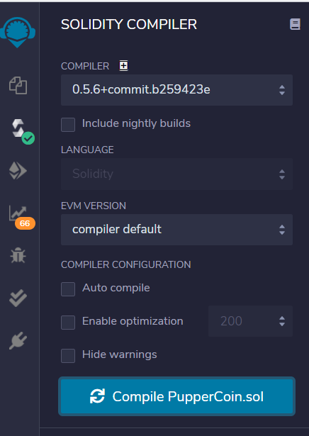
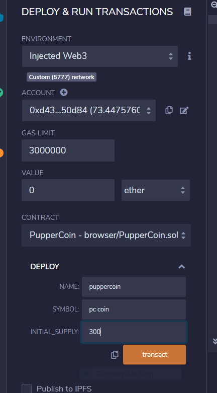
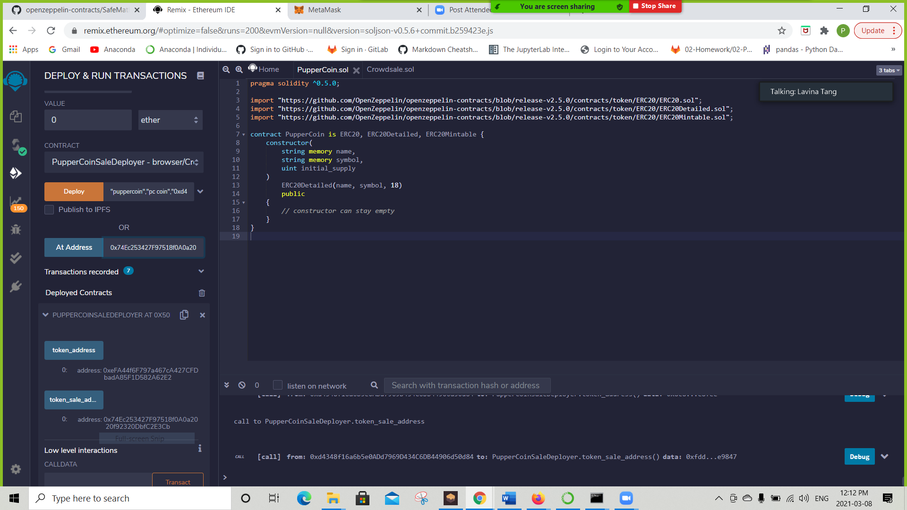
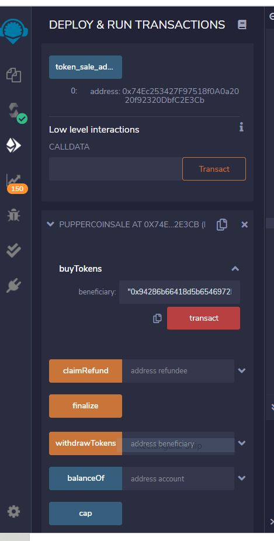
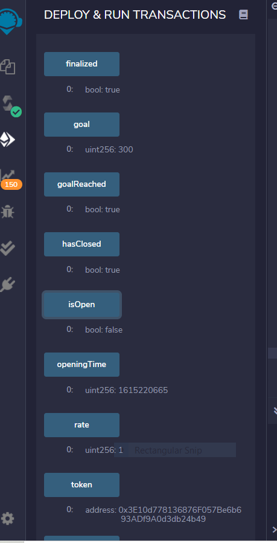
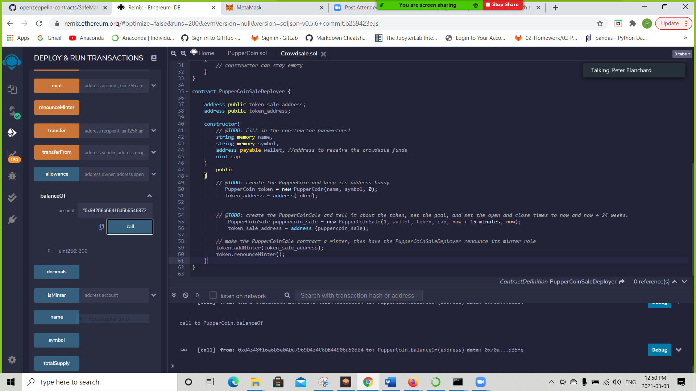

# Unit 21: You sure can attract a crowd!

## Steps In Deploying
* Create smart Conytacts:
  
  PupperCoin.sol, CrowdSale.sol
  
* Compile smart contracts using proper compiler

* Deploy smart contracts:
* PupperCoin

* Deploy PupperCoinSaleDeployer:

## Using the Smart Contracts

* Buying Tokens:

* Shows recent infomation about the smart contract:

* Showing Balance of Beneficiary:

